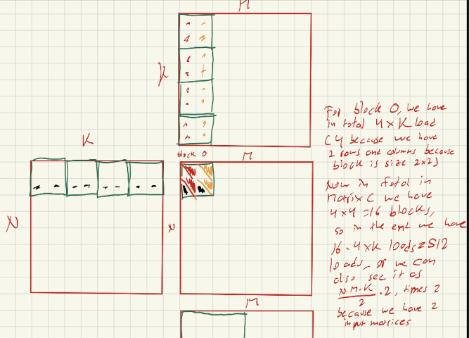
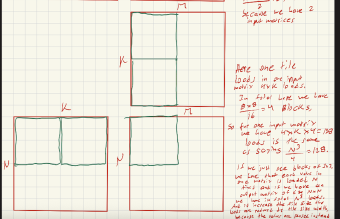

# CUDA Memory and Performance Questions

1. **Matrix Addition and Shared Memory**  
   Consider matrix addition. Can one use shared memory to reduce the global memory bandwidth consumption?  
   *Hint:* Analyze the elements that are accessed by each thread and see whether there is any commonality between threads.

   **Answer**: NO, because it won't help as computation for each value in A and B are done only once by each separate thread. Each value of A and B is only loaded once (once by a single thread from the whole grid)

2. **Bandwidth Reduction in Tiled GEMM**  
   Draw the equivalent of Fig. 5.7 for an \(8 \times 8\) matrix multiplication with \(2 \times 2\) tiling and with \(4 \times 4\) tiling. Verify that the reduction in global memory bandwidth is indeed proportional to the tile dimension \(T\).

   **Answer**: , 

3. **Omitting __syncthreads()**  
   What type of incorrect execution behavior can happen if one forgot to use one or both `__syncthreads()` in the kernel of Fig. 5.9?

   ```c++
   #define TILE_WIDTH 16

    __global__ void matrixMulKernel(float* M, float* N, float* P, int Width) {
        __shared__ float Mds[TILE_WIDTH][TILE_WIDTH];
        __shared__ float Nds[TILE_WIDTH][TILE_WIDTH];

        int bx = blockIdx.x;
        int by = blockIdx.y;
        int tx = threadIdx.x;
        int ty = threadIdx.y;

        // Identify the row and column of the P element to work on
        int Row = by * TILE_WIDTH + ty;
        int Col = bx * TILE_WIDTH + tx;

        // Loop over the M and N tiles required to compute the P element
        float Pvalue = 0.0f;
        int numTiles = Width / TILE_WIDTH;
        for (int ph = 0; ph < numTiles; ++ph) {
            // Collaborative loading of M and N tiles into shared memory
            Mds[ty][tx] = M[Row * Width + ph * TILE_WIDTH + tx];
            Nds[ty][tx] = N[(ph * TILE_WIDTH + ty) * Width + Col];
            __syncthreads();

            // Multiply the two tiles together
            for (int k = 0; k < TILE_WIDTH; ++k) {
                Pvalue += Mds[ty][k] * Nds[k][tx];
            }
            __syncthreads();
        }

        // Write the block result to global memory
        P[Row * Width + Col] = Pvalue;
   ```

   **Answer**: If we remove the sync from phase 0, we would read random values (on iteration 0) or pas values when doing the operations on phase 1. And if we remove the the sync in phase 1, we would have the problem where a thread would rewrite a value that a thread was going to use in a calculation on phase 1

4. **Shared Memory vs. Registers**  
   Assuming that capacity is not an issue for registers or shared memory, give one important reason why it would be valuable to use shared memory instead of registers to hold values fetched from global memory. Explain your answer.

   **Answer**: To have a block work together if values are reused by some threads in the block, this way, we reduce the amount of loads to global memory.

5. **Bandwidth Reduction for a \(32 \times 32\) Tile**  
   For our tiled matrix–matrix multiplication kernel, if we use a \(32 \times 32\) tile, what is the reduction of memory bandwidth usage for input matrices \(M\) and \(N\)?

    **Answer**: 32 times

6. **Local Variable Instances**  
   Assume that a CUDA kernel is launched with 1000 thread blocks, each of which has 512 threads. If a variable is declared as a local variable in the kernel, how many versions of the variable will be created through the lifetime of the execution of the kernel?

   **Answer**: 512,000 copies of the same variable

7. **Shared Variable Instances**  
   In the previous question, if a variable is declared as a shared memory variable, how many versions of the variable will be created through the lifetime of the execution of the kernel?

   **Answer**: 1000 copies (because only each block creates a version instead of each thread)

8. **Global‐Memory Requests per Element in GEMM**  
   Consider performing a matrix multiplication of two input matrices with dimensions \(N \times N\). How many times is each element in the input matrices requested from global memory when:  
   a. There is **no** tiling?  **Answer**: We have $N$ loads for each value
   b. Tiles of size \(T \times T\) are used? **Answer**: $\frac{N}{T}$ 

9. **Compute‐ vs. Memory‐Bound Kernel**  
   A kernel performs 36 floating-point operations and seven 32-bit global memory accesses per thread. For each of the following device properties, indicate whether this kernel is compute-bound or memory-bound: $\frac{36}{7 \cdot 4} = \frac{9}{7}$ 
   a. Peak FLOPS = 200 GFLOPS, peak memory bandwidth = 100 GB/s  **Answer**: $100 \cdot \frac{9}{7} \approx 128.57 \text{GFLOPS}$, so this one is memory bound 
   b. Peak FLOPS = 300 GFLOPS, peak memory bandwidth = 250 GB/s  **Answer**: $250 \cdot \frac{9}{7} \approx 321.43 \text{GFLOPS}$, so this kernel is compute bound

10. **Tile Transpose Kernel Correctness**  
    A new CUDA programmer has written a device kernel that transposes each tile in a matrix. The tiles are of size `BLOCK_WIDTH × BLOCK_WIDTH`, and each dimension of matrix `A` is a multiple of `BLOCK_WIDTH`. `BLOCK_WIDTH` is known at compile time and can range from 1 to 20.

    ```c
    __global__ void transpose_tile(float *A, int width) {
      __shared__ float tile[BLOCK_WIDTH][BLOCK_WIDTH];
      int x = blockIdx.x * BLOCK_WIDTH + threadIdx.x;
      int y = blockIdx.y * BLOCK_WIDTH + threadIdx.y;

      // Phase 1: load into shared memory
      tile[threadIdx.y][threadIdx.x] = A[y * width + x];

      // Phase 2: write back transposed
      x = blockIdx.y * BLOCK_WIDTH + threadIdx.x;
      y = blockIdx.x * BLOCK_WIDTH + threadIdx.y;
      A[y * width + x] = tile[threadIdx.x][threadIdx.y];
    }
    ```

    a. Out of the possible range of values for `BLOCK_WIDTH`, for what values will this kernel execute correctly on the device?  **Answer**: $\{1,2,3,4,5\}$
    b. If the code does not execute correctly for all `BLOCK_WIDTH` values, what is the root cause of this incorrect behavior? Suggest a fix to make it work for all `BLOCK_WIDTH` values. **Answer**: The reason we can't use more than 6 is that at least for a warp when there is no divergence (in modern GPUs) they execute in lockstep (they is implicit synchronization) there is no problem with not having `__syncthreads()`, but for size $6$ or more we need `__syncthreads()` before changing the value of A


11. **Kernel Variable Instances**  
    Consider the following CUDA kernel and its host launcher:

    ```c
    __global__ void foo_kernel(float* a, float* b) {
      unsigned int i = blockIdx.x * blockDim.x + threadIdx.x;
      float x[4];
      __shared__ float y_s;
      __shared__ float b_s[128];

      for (unsigned int j = 0; j < 4; ++j) {
        x[j] = a[j * blockDim.x * gridDim.x + i];
      }
      if (threadIdx.x == 0) {
        y_s = 7.4f;
      }
      b_s[threadIdx.x] = b[i];
      __syncthreads();

      b[i] = 2.5f * x[0]
           + 3.7f * x[1]
           + 6.3f * x[2]
           + 8.5f * x[3]
           + y_s * b_s[threadIdx.x]
           + b_s[(threadIdx.x + 3) % 128];
    }

    void foo(int* a_d, int* b_d) {
      unsigned int N = 1024;
      foo_kernel<<< (N + 128 - 1) / 128, 128 >>>(a_d, b_d);
    }
    ```

    a. How many versions of the variable `i` are there?  **Answer**: 1024
    b. How many versions of the array `x[]` are there?  **Answer**: 1024
    c. How many versions of the variable `y_s` are there?  **Answer**: 8
    d. How many versions of the array `b_s[]` are there? **Answer**: 8 
    e. What is the amount of shared memory used per block (in bytes)?  **Answer**: We have one float for y_s and 128 for b_s so we have in total $128 \cdot 4 + 1 \cdot 4 = 516$ bytes  
    f. What is the floating-point to global memory access ratio of the kernel (in OP/B)? **Answer**: We have only 10 Floating point operations (we don't count the operations to get indices) and 5 loads with one store to global memory so we have $\frac{10}{6 \cdot 4} = \frac{10}{24} = \frac{5}{12}$

12. **Occupancy Analysis**  
    Consider a GPU with the following hardware limits per SM:  
    - 2048 threads  
    - 32 blocks  
    - 65 536 registers  
    - 96 KB shared memory  

    For each kernel characteristic below, specify whether the kernel can achieve full occupancy. If not, state the limiting resource.

    a. The kernel uses 64 threads/block, 27 registers/thread, and 4 KB shared memory/block.  **Answer**: We have $\frac{2048}{64} = 32 \text{blocks}$, then $ 2048 * 27 < 64K$ and finally we have that $4KB \cdot 32 = 128KB > 96KB$, Here the amount of memory surpasses that of the SM and SM where each block uses 4Kb can only have $96/4 = 24$ blocks, so here we would have an occupancy of $\frac{24 \cdot 64}{2048} \cdot 100 = 75\%$ 
    b. The kernel uses 256 threads/block, 31 registers/thread, and 8 KB shared memory/block. **Answer**: here we have that $2048/256 = 8$, then $2048 * 31 < 64K$ and finally $8 * 8KB = 64KB < 96KB$, so this kernel in the end has a $100\%$ occupancy